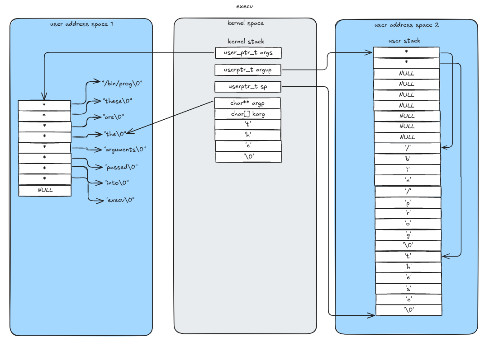
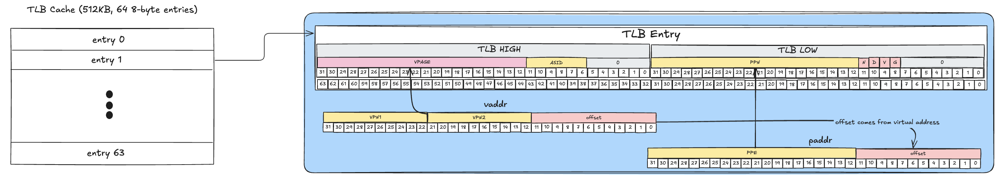
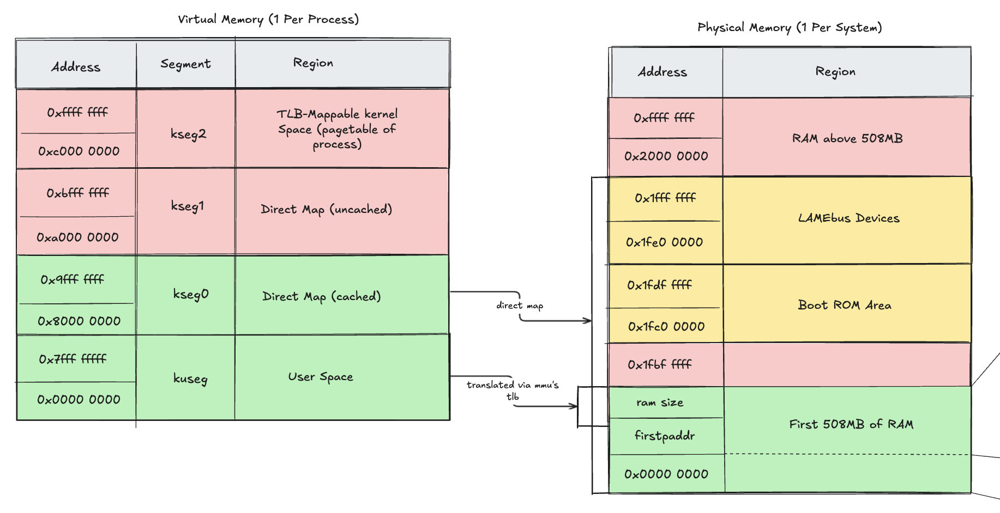
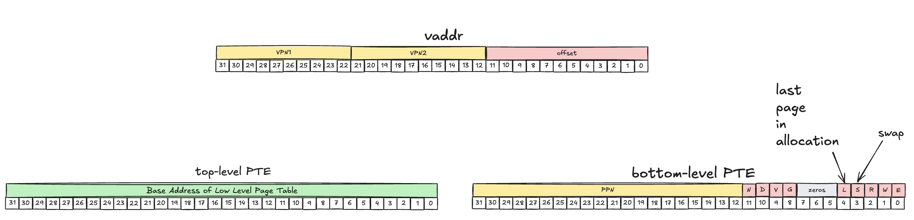

# CPEN 331 - Operating Systems

This repository will be used write, learn, and submit assignments about/on OS161.
OS161 is an educational OS. The full documentation for it can be found here - [OS161 Documentation](http://www.os161.org/).

## Assignment 4: Implementing file-related syscalls
Status: Done

### [Reading Questions](submit/asst4/ass4-answers.md)

### [Logbook](docs/asst4_logbook.md)

### System Diagram

### Files
- `kern/include/`
    -  `abstractfile.h` abstraction for a file
    -  `filetable.h`    file table to manage open file in the system (usually global to the whole system)
    - `proctable.h`     process table to manage all running processes (usually global to the whole system)

- `kern/file/`
    - `file.c`      implementation of file functions
    - `filetable.c` implementation of file table functions
    - `proctable.c` implementation of proccess table functions

##### System calls 
All systemcalls are implmented in their own .c file and declered in syscall.h
- `kern/syscall`
    - `open.c`
    - `close.c`
    - `read.c`
    - `write.c`
    - `dup2.c`      duplicated an existing file descriptor to a new file descriptor, points to the same actual file
    - `__getcwd.c`  get current working directory
    - `chdir.c`     change directory

## Assignment 5: Implementing processes
Status: Done

### [Logbook](docs/asst5_logbook.md)

### The Death of a Process

##### System calls 
All systemcalls are implmented in their own .c file and declered in syscall.h
- `kern/syscall`
    - `fork.c`      duplicates an existing process
    - `execv.c`     makes a running process run an executable

    - `waitpid.c`   makes a parent process wait for a child process to finish executing
    - `getpid.c`
    - `_exit.c`     exits a process

## Assignment 6: Implementing Virtual Memory 
Status: In progress

### Virtual Machine
The code implemented for this assignment can be found in the following files:
- `kern/arch/mips/vm/`  directory for machine depended code for the virutal machine
    - `dumbervm.c`      our main implementation of pagetables for the mips architecure 
    - `swapspace.c`     implementation of swap space
- `kern/include`
    - `vm.h`            declerations of required functionality for our virtual machine
    - `swapspace.h`     declerations of required functionality for our swap space 
- `kern/syscall/sbrk.c` sbrk systemcall to manage user heap, allowing user programs to call malloc and free

### MIPS Translation Lookaside Buffer (TLB)
The translation lookaside buffer is a cache used by the MIPS MMU to translate virtual addresses to physical address.

### OS 161/MIPS Memory Map
In this assignment we implemented the user of virtual addresses by both the kernel and user programs.

### Page Table Design

### TLB Fault and Page Allocation

## Resources
[OS161 Source Code Layout - os161.org](http://www.os161.org/resources/layout.html)

[SFS Definition - harvard.edu](https://www.eecs.harvard.edu/~cs161/assignments/a4.html)